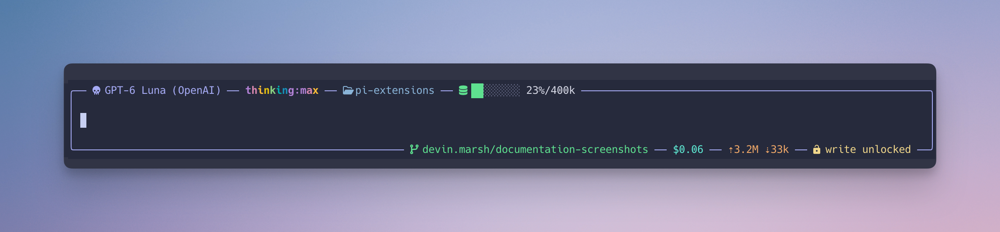

# context-footer

A small [pi](https://github.com/earendil-works/pi-coding-agent) extension that
draws a continuous border around the prompt editor and sets session state into
the rule itself, inspired by
[`pi-powerline-footer`](https://github.com/nicobailon/pi-powerline-footer).



## Layout

The frame is one unbroken box — `╭──╮`, vertical rails down both sides, `╰──╯` —
interrupted only where an item sits in the rule:

```text
╭── 󰚌 Claude Sonnet 5 ── thinking:high ──  pi-extensions ──  ░░░░░░░░ 5%/1.0M ── 󰓹 my-feature-work ──╮
│                                                                                                    │
│ what shape should the border take?                                                                 │
│                                                                                                    │
╰────────────────────────────────  devin.marsh/context-footer ── #4 ── ⇡47k ⇣5 ── 󰌿 write unlocked ──╯
```

## Configuration

What the frame shows, and where, is set under `layout` in
`<agent dir>/pi-context-footer/config.json`. Four regions — `topLeft`,
`topRight`, `bottomLeft` and `bottomRight` — each list their items in order:

```json
{
  "layout": {
    "bottomRight": ["branch", "tokens", { "status": "write-lock", "color": "warning" }]
  }
}
```

The built-in items are `model`, `thinking`, `directory`, `context`,
`session-name`, `hostname`, `branch`, `pull-request` and `tokens`.
`{ "status": "<key>" }` shows a status another extension publishes, such as a
session cost. A region left out keeps its default; one given replaces it.
[`examples/`](examples/) has the default layout and a couple of variations.

`/context-footer statuses` lists the statuses you can select, and
`/context-footer reload` applies an edited file without restarting pi.

### Showing your extension's status

Publish it with pi's own `ctx.ui.setStatus(key, text)`; there is no footer
API to call. It appears once the user adds `{ "status": "<key>" }` to their
layout, and pi's standard footer shows it too. The text is shown as
published, on one line: put any icon or freshness wording in it yourself,
and clear it with `setStatus(key, undefined)` when there is nothing to show.
By default the footer repaints it in one theme color; the user can keep your
colors instead.

### Custom status formatters

`statusFormatters` names a trusted JavaScript module outside the extension.
Relative paths resolve beside `config.json`; absolute paths and `~/` work too:

```json
{ "statusFormatters": "./status-formatters.mjs" }
```

The module default-exports an object keyed by exact status name:

```js
export default {
  "example-work": (text) => text === "work ready" ? "ready" : undefined,
};
```

Functions receive sanitized status text and run synchronously when that status
is drawn, including in `remainingStatuses`. Return a string to replace it,
`""` to hide it, or `null`/`undefined` to keep it unchanged. Thrown errors and
invalid return values also keep the original. Output is sanitized again before
the layout's existing color and width settings apply; published statuses and
other consumers are untouched.

The module loads at startup and is re-evaluated by `/context-footer reload`.
An invalid module warns once per load; reload keeps the last valid formatters.
Omit the setting or set it to `null` to disable formatting. These modules run
with Pi's permissions: load only trusted code and keep callbacks fast and
side-effect-free.

## Padding

A column of air sits between each rail and the input, and by default a blank
rail row sits above and below it, so the text is not cramped against the frame.
The horizontal gutters are paid for the same way as the rails: the inner editor
renders that much narrower.

```text
/context-footer pad         report the current padding
/context-footer pad full    a blank row above and below the input (default)
/context-footer pad none    no blank row
```

There is no half step, because a terminal row is atomic. Hugging the rule to a
cell edge with `▔`/`▁` would free vertical space without spending a row, but
box-drawing `─` is inked at text height, and that is exactly what lets a status
item read as a break in the line — move the ink to the top of the cell and the
label no longer interrupts the rule, it sits beneath it.

The **top run** carries identity and context health: model, thinking level,
working directory, context gauge and window, and the session name
(right-anchored, when one is set). The **bottom run** carries the hostname
(left-anchored, when enabled) and the remaining session items: git branch, its
pull request, cache-inclusive input/output token totals, and background-task
and write-lock state.

### Directory

Outside a Git repository, the directory item is a folder and the working
directory's name. Inside one, it is a four-pointed star
(`nf-md-star_four_points_outline`) and the repository's name, followed, below
the repository root, by a folder and the current directory's name alone — not
the path in between. The name comes from the repository's shared Git
directory, so a linked worktree shows the repository it belongs to. `git` runs
once per working directory, in the background; until it answers, the item
shows the plain directory.

The repository is painted with the theme's `repoText` color and the directory
with `directoryText`; themes without them fall back to `syntaxKeyword` and
`syntaxFunction`.

### Pull request

When `gh` reports a pull request for the current branch, its number follows the
branch as an OSC 8 hyperlink — ⌘-click, or whatever the terminal binds. The
lookup runs in the background, never blocking a render, and only while the
footer is on and its layout selects the `pull-request` item, whether or not the
item currently fits on screen. A found pull request is
kept for the session; a miss is kept for a minute, so a branch without a pull
request spawns `gh` at most once a minute, and one opened mid-session appears
within a minute. If `gh` is missing,
unauthenticated, or slow, the item is simply absent.

### Session name

When a session has a display name (set with `pi --name <name>` or the RPC
`set_session_name`), it is anchored at the top-right corner of the frame,
marked with the Nerd Font `nf-md-tag` glyph and painted with the theme's
`emphasisText` color (defined by the frontier-funds theme; the accent
color in themes without it). A session
without a name shows nothing there — the top run stays left-aligned as
before.

### Hostname

The machine's hostname can be anchored at the bottom-left corner, the mirror
of the session name: marked with the Nerd Font `nf-fa-server` glyph and
painted in the same color, so the two identity labels read as a pair at
opposite corners. It is off by default and configured under the `hostname` key
of `<agent dir>/pi-context-footer/config.json` (the same file as the animation
preference):

```json
{
  "hostname": {
    "show": true,
    "match": "^devbox-(.+)$",
    "nickname": "box $1",
    "nicknames": {
      "devbox-17.corp.example": "devbox",
      "my-laptop.local": "laptop"
    }
  }
}
```

- **`show`** — the simple switch. `/context-footer host on|off` writes it.
- **`match`** — a regex tested against the real hostname, case-insensitively.
  When set, it decides on its own and `show` is ignored: the item appears
  exactly when the pattern matches. One dotfiles-managed config can therefore
  show the name on remote machines and hide it on the laptop.
- **`nickname`** — a label template expanded from `match`'s captures, for
  machines whose names are not known in advance. It uses the reference syntax
  of JavaScript's `String.prototype.replace`: `$1` for a numbered group,
  `$<name>` for a named one, `$&` for the whole match, `$$` for a dollar sign.
  With the example above, `devbox-42` is shown as `box 42`. A template that
  expands to nothing shows the real hostname.
- **`nicknames`** — hostname → label to display instead. Keys match
  case-insensitively, by the full name first and then by its first label, so
  `devbox-17` also covers `devbox-17.corp.example`. An entry here wins over
  `nickname`. `match` always tests the real hostname, not the nickname.

The file is read at session start; `/context-footer host` re-reads it and
reports what is shown and why, so edits to the regex or nicknames apply
without a restart. A malformed entry is reported once as a warning; an invalid
regex falls back to `show`. Like the session name, the hostname is kept
when the bottom run is too wide and the run's other items are cut first.

The identity color is the theme's `emphasisText`. Themes that do not define
it, including pi's default themes, fall back to the accent color rather than
crashing the render.

Items are separated by short runs of rule, so the border reads as continuous
line broken by labels rather than as a line with a separate status bar attached.
The top run is left-aligned and the bottom run right-aligned, so the long
unbroken stretch of each rule falls on the opposite corner from the other's —
which gives the input more apparent room than packing both runs left. When a
session name is set it is anchored at the top-right corner, behind the
left-aligned run; a shown hostname is the mirror, anchored at the bottom-left
corner ahead of the right-aligned run. When a run is wider than the terminal, its content is
truncated with `…` and the frame still closes.

### Cases the frame absorbs

- **Autocomplete.** Pi appends its completion list below the editor's lower
  rule. That rule becomes a `├──┤` divider, the list gets rails, and the status
  run closes the box underneath — so the completion popup renders *inside* the
  frame instead of below a dangling border.
- **A scrolled input.** When the prompt has more lines than fit, pi replaces a
  rule row with a `↑ N more` marker. That marker is folded into the frame as an
  item of its own rather than displacing the border.
- **Narrow terminals.** Below 24 columns there is no room for a rule plus a
  label, so the extension steps aside and returns pi's own editor rows untouched.

### Colors

The frame is chrome, not signal: it paints the theme's `border` color and does
not follow pi's thinking-level tint, which can be near-invisible where a theme
maps `thinkingOff` to a rule shade — the badge in the top run carries the
thinking state. Bash mode is the one exception: the frame keeps pi's green
tint, detected with the same predicate pi itself uses — `!` at the head of the
input. The pull request number uses the theme's link color.

The thinking-level scheme lives in
[`lib/thinking-colors.ts`](../README.md#libthinking-colorsts), shared with
`pi-model-picker` so a level looks identical in the picker's level list and in
the border. One deliberate exception: the `off` badge paints dim rather than
the scheme's `thinkingOff` color, which themes may map to rule shades meant
for barely-visible separators — with the frame itself untinted, the badge is
the off state's only announcement, so it stays legible. The model picker's
DeepSeek toggle rows paint `off` dim for the same reason. Thinking colors match `pi-powerline-footer`: `minimal`, `low`, and `medium` use
pi's corresponding thinking colors; `high` uses its exact purple → pink →
yellow → green → cyan → blue gradient. Above that the treatment escalates on
the same palette: `xhigh` is the same gradient, bold, with each character
backed by a dark tint derived from its own color, and `max` — bold — adds a
white gloss that sweeps across the characters, one step per 80ms, then rests
on the plain rainbow for ~2s before the next pass. pi repaints on demand — there is no idle frame loop — so while the gloss
is on screen the extension keeps an 80ms `requestRender` interval of its own,
the same mechanism pi's working spinner uses, and the shimmer runs at the same
speed whether you are typing, the agent is working, or the prompt is idle.
The ticker is started and stopped from the editor's render path: every
transition that could show or hide the label — a level change,
`/context-footer`, a resize, a model without reasoning — is followed by a
render, so no subscriptions are needed to keep it truthful, and
`session_shutdown` stops it so it can never pin the event loop at exit. The
shimmer can be switched off with `/context-footer animate off` (persisted;
see Usage). That one preference governs the whole scheme, so it also stills the
gloss in `pi-model-picker`'s level list. The gloss's animation only ever changes foreground color, so the
shimmer cannot shift the layout or leak attributes into the rest of the
border; below 24 columns the plain footer carries the label with the gloss
pinned, never moving. The model marker is the Nerd Font `nf-md-skull` glyph.

## Tokens

The `tokens` item shows cache-inclusive input and output token totals across
the whole session: every usage pi records — assistant responses, usage a tool
reported for itself, the calls behind a compaction or branch summary, and
standalone usage such as cache warming — including those on abandoned
branches. Sessions from older pi versions simply have fewer kinds. It counts
recorded usage; it does not price it.

The footer computes no cost. To show one, select a status that another
extension publishes as a status item; what that figure covers, and how fresh
it is, is up to its producer. When it is not published, no cost is shown.

## Copying out of the prompt

The rails are real characters, so a normal drag across them copies them too —
no terminal offers a way to mark a glyph unselectable. Use rectangular
selection to take just the text: ⌥-drag in iTerm2, Terminal.app, and Ghostty
selects only the columns dragged across.

Drawing the rails as background-tinted spaces instead would copy as whitespace,
but a background fills the whole cell, so the rail becomes a band rather than a
hairline and joins the corners less cleanly. The hairline won out.

## Default status items

The default layout selects two statuses other extensions publish, as ordinary
status items: `background-tasks` from `pi-background-tasks`, repainted in the
accent color, so its task indicator and entry keys stay visible once this
footer replaces pi's; and `write-lock` from `pi-write-lock`, repainted in the
warning color. Producers own their text, icons included — the footer shows it
as published and reads nothing into it. Other statuses, such as the MCP server
count, stay off the frame to keep the prompt area quiet, unless the owner
selects them.

## Usage

The extension activates automatically when it is linked into a pi extension
discovery directory.

```text
/context-footer            toggle the decoration
/context-footer on         enable it
/context-footer off        disable it
/context-footer reload     re-read config.json and the status formatter module
/context-footer pad none   set the padding (see above)
/context-footer animate [on|off]   report or toggle the traveling gloss
/context-footer host [on|off]      report the hostname state, or set its switch
```

The animation preference and the hostname settings are machine settings
rather than session choices, so they persist across sessions in
`<agent dir>/pi-context-footer/config.json`. Each command rewrites only its own
key, and refuses to overwrite a file that does not parse, so a hand edit in
progress is never lost.
With animation off the gloss is not removed — it stays pinned at the head of
the label, the static form of the same effect, and the repaint loop stays
down.

`off` leaves the editor wrapper installed but inert, which avoids removing a
subsequently installed editor integration such as the `/model` interceptor, and
hands the footer back to pi so the session information does not simply vanish.

For the same reason, the footer renders the status as two plain rows whenever
the terminal is too narrow to frame — replacing pi's footer and then declining
to draw is how the model and context would disappear entirely.

## Development

```bash
npm run test:context-footer             # unit tests and a fake-pi host, run by npm run check
python3 pi-context-footer/tui.test.py   # the real pi on PATH in a pty; needs pyte
```

Run `node scripts/link-extensions.mjs --yes` from the repository root after a
fresh checkout. It adds both the project-local and global symlinks needed to
load this extension.
