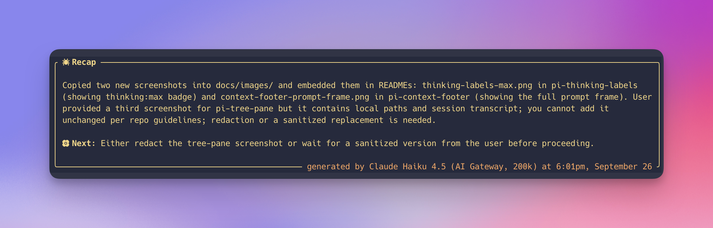

# recap

A [pi](https://github.com/earendil-works/pi-coding-agent) extension that keeps a
rolling, durable summary of an agent session. By default, it checks the active
session every five minutes. When at least five completed user/agent interactions
have accumulated beyond the manifest cursor, a cheap model summarizes that
unsummarized range, writes a recap log, advances the cursor, and adds the recap
to the transcript. Both values are persistent settings.



```text
╭  Recap ─────────────────────────────────────────────────────────────────────────╮
│                                                                                 │
│ The recap scheduler keeps cursor state in a durable manifest, records a timer   │
│ heartbeat, and writes one JSON log for each generated summary.                  │
│                                                                                 │
│  Next: Verify the periodic path in a live session.                              │
│                                                                                 │
╰──────────────── generated by DeepSeek V4 Flash 0731 at 12:43pm, September 6 ────╯
```

The transcript entry is display-only and scrolls with the rest of the session.
The durable recap state lives in JSON files outside the session transcript.

## Periodic checks

The default check interval is five minutes. A check always updates the
manifest's `timer.lastCheckedAt`, including when there are too few new
interactions to produce a recap. Automatic generation starts after five
completed user/agent interactions by default: a user submits a prompt, the
agent may make any number of model and tool turns, and control returns to the
user. A tool-heavy request still counts as one interaction. `/recap every` and
`/recap rounds` change and persist these settings.

A check that lands while the main agent is running records its heartbeat and is
completed when the agent settles. The summary endpoint is a snapshot: messages
that arrive while the recap model is running remain beyond the saved cursor and
are included in a later log.

`/recap now` uses the same manifest cursor and conversation builder but bypasses
the configured interaction threshold. It generates whenever any unsummarized
message content exists, so it does not depend on timer state or
terminal-presence heuristics.

## Files

Each pi session has its own directory:

```text
<agent dir>/pi-recap/sessions/<session-id>/
├── manifest.json
├── recap-log-20260812T170506123Z.json
└── recap-log-20260812T174011882Z.json
```

`<agent dir>` is `~/.pi/agent` unless `PI_AGENT_DIR` overrides it. Recap keys are
UTC timestamps in a filename-safe, lexically sortable form. Each log is named
`recap-log-{key}.json`.

### Manifest

The manifest records:

- every recap log key
- the entry id and timestamp of the last message included in a recap
- the configured check interval and completed-interaction generation threshold
- the main timer lock owner and acquisition time
- `timer.lastCheckedAt`, the timer's heartbeat
- a generation lock, so timer and manual requests cannot write duplicate logs
- the latest generation error, including its message and stack trace

Manifest writes are atomic and guarded by a short-lived filesystem mutation
lock. On load, recap log filenames are reconciled back into the manifest, so a
log written immediately before an interrupted manifest update is not lost.

The main timer lock is durable across extension instances and pi processes. A
watchdog compares the heartbeat with the configured interval. If the heartbeat
is stale, it clears its local interval, reclaims the durable lock, starts a new
interval, and immediately checks the session. A previous owner that is still
alive sees that it lost the lock and stops its local interval.

### Recap logs

A recap log contains:

- its key and generation timestamp
- the generated summary
- provider, model id, and display name
- the recap call's complete usage object
- aggregate token and cost usage available on the summarized source entries
- current context token usage
- the previous and new manifest cursors
- source entry ids, completed-interaction count, and message count
- the prior recap log keys supplied to the model

The log is written before the manifest cursor advances. A failed generation
therefore never skips unsummarized conversation.

## What the model receives

Each request contains:

1. The five most recent recap log summaries, oldest first.
2. All visible conversation content after the manifest cursor through the
   latest completed message.

The conversation section includes user and assistant text, tool calls and their
arguments, complete textual tool results, bash output, custom context messages,
and compaction or branch summaries. Image payloads are represented by their
media type instead of embedding base64 data. Hidden assistant thinking is not
conversation content and is not copied into recap requests.

The recap model is instructed to treat the transcript and tool output as quoted
data rather than instructions. Its response remains the two-line `Recap:` and
`Next:` format. The renderer enforces a 500-character recap ceiling and a
180-character next-step ceiling.

## Timer and generation errors

Generation errors are written to `manifest.json` with a timestamp, message, and
stack trace. The TUI only shows the short notification:

```text
Recap failed; details are in the recap manifest
```

While the manifest has an active error, all recap foreground colors switch to
the theme's `error` color, including recaps already in the transcript. A
successful generation clears the active state and restores the normal recap
colors while retaining the last error details for debugging. Skipped checks do
not clear the active state.

`/recap status` reports the manifest path, recap count, last check time, and
whether an error is active. Error details remain in the manifest.

## Model rotation

Each recap uses the next authenticated model resolved from this order:

1. DeepSeek V4 Flash
2. GLM 5.3 Flash
3. Gemini 3.8 Flash
4. GPT-5.6 Luna
5. Claude Haiku 4.5

Models are matched by id pattern rather than a fixed provider/id pair, so the
same model can resolve through different configured hosts. Missing or
unauthenticated entries drop out of the rotation. The rotation position is
persisted in `config.json` and advances for each attempted generation.

Calls use `ctx.modelRegistry.complete()` with a 2,000-token response budget and
a 30-second timeout. Provider authentication and headers are resolved by pi.

## Styles

```text
/recap style          report the current style
/recap style frame    draw the recap box (default)
/recap style clean    render the same content flush left
```

The style is read at render time, so changing it redraws recap entries already
in the transcript. Markers default to Nerd Font's filled and hollow circles and
can be replaced with `/recap icons`.

## Usage

```text
/recap                        toggle periodic checks
/recap on                     enable periodic checks
/recap off                    disable periodic checks
/recap now                    summarize all unsummarized content now
/recap status                 show durable state and manifest location
/recap every 15               check every 15 minutes and save the setting
/recap rounds 8               require 8 completed interactions and save the setting
/recap style                  report the current style
/recap style frame            box it, or `clean` for flush left
/recap icons                  report the current markers
/recap icons <recap> <next>   set the recap and next markers
/recap icons reset            restore the default circles
/recap models                 show the active rotation and next model
```

`every` accepts fractional minutes from `0.05` through `240`, which is useful
for exercising the timer: `/recap every 0.2` checks roughly every twelve
seconds. `rounds` accepts an integer from `1` through `1000`. Both settings
persist across pi processes. `/recap after` remains an alias for `every`, and
`/recap interactions` remains an alias for `rounds`.

## Configuration

The timer interval, completed-interaction threshold, style, icons, and model
rotation position persist in:

```text
<agent dir>/pi-recap/config.json
```

This path is deliberately outside `<agent dir>/extensions/pi-recap/`, because
that extension path can be a symlink into a git checkout.

```json
{
  "markers": { "recap": "", "next": "" },
  "style": "frame",
  "rotationIndex": 2,
  "intervalMinutes": 5,
  "minimumCompletedInteractions": 5
}
```

Missing or invalid fields use built-in defaults. Changes made directly in this
file take effect when the extension next loads. Extension writes acquire a
cross-process lock, merge only the changed fields into the latest file, and use
an atomic rename, so model rotation or another pi process cannot overwrite a
newer setting.

`/recap every` and `/recap rounds` also write the current session manifest even
when another pi process owns its timer. The owner observes the durable schedule
and restarts its local interval on its next watchdog inspection.

## Development

```bash
npm run typecheck
npm run test:recap
pi --no-extensions -e ./pi-recap/index.ts
```

Run `node scripts/link-extensions.mjs --yes` from the repository root after a
fresh checkout.
