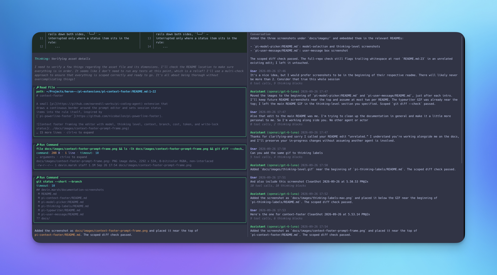

# pi-tree-pane

An experimental [pi](https://github.com/earendil-works/pi-coding-agent) extension for the **fullscreen TUI**. `/tree-pane` toggles a two-column transcript: Pi's existing feed (including tool calls, output, and its normal scrolling) on the left, and a separately scrollable conversation on the right. The editor, status, widgets, and footer remain full-width.



## Try it

From a stable repository checkout, `node scripts/link-extensions.mjs` creates both the project-local and global links. Then launch Pi from any directory:

```bash
pi --tui-mode fullscreen
```

Enter `/tree-pane` to enable the split; enter it again to disable it. `/tree-pane on|off|status` is also available. The toggle starts off, so loading the extension does not change the layout until you enable it.

The right pane shows user and assistant text from the active session branch, updates as assistant text streams, and represents image attachments as `[image]`. It omits thinking text, tool details and results, and extension messages; brief counts show thinking blocks and tool calls between messages. It follows the latest message until you scroll. Scroll over either pane with the mouse or drag the right scrollbar. Use **Alt+K** to page up, **Alt+J** to page down, and **Alt+G** to return to the latest message. Pi's normal transcript keys still scroll the left pane.

Below 36 terminal columns, the right pane is hidden; it reappears on resize. Switching away from fullscreen mode via `/settings` detaches the split; toggle it on again after returning to fullscreen.

## Compatibility

Fullscreen mode is required. The split is available only on supported Pi transcript layouts. Pi 0.85.1 and 0.87.1 are tested; Pi 0.84.1 lacks the mouse and scrollbar APIs used here.
